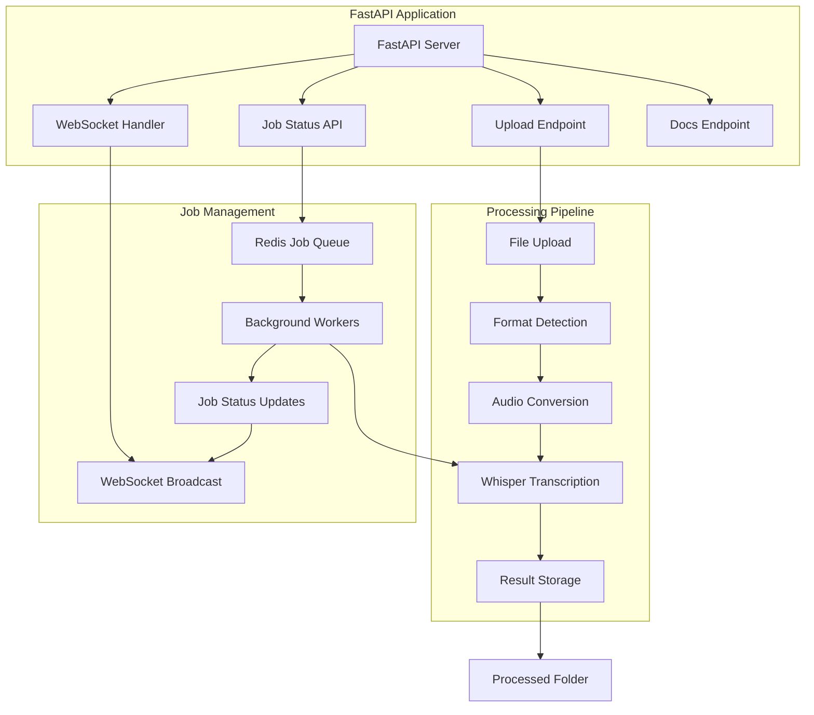
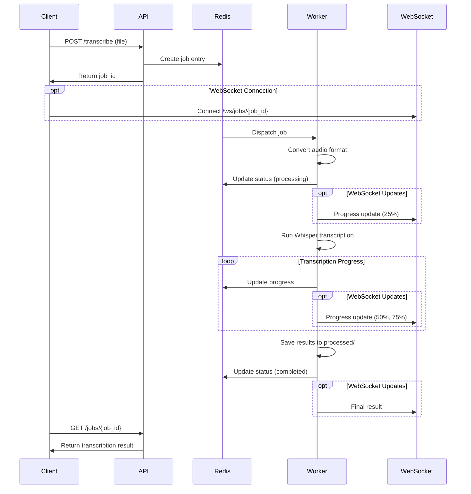

# Product Requirements Document: FastAPI Whisper Transcription Service

## 📋 Executive Summary

This document outlines the requirements and architecture for transforming the existing Whisper CUDA container into a FastAPI-based transcription service. The service will provide REST API endpoints with automatic audio format conversion, async job processing, and optional real-time WebSocket streaming for AI chatbot integration.

## 🎯 Project Objectives

### Primary Goals
- Create a FastAPI service with automatic API documentation at `/docs`
- Support all FFmpeg-compatible audio formats with automatic conversion
- Implement async job queue for reliable processing
- Provide optional WebSocket streaming for real-time progress updates
- Optimize for single-user AI chatbot integration

### Success Criteria
- API responds within 100ms for job submission
- Supports all major audio formats (WAV, MP3, M4A, FLAC, OGG, WMA, AAC, WebM)
- Provides real-time transcription progress via WebSocket
- Maintains existing GPU acceleration performance
- Zero-configuration deployment

## 🏗️ System Architecture

### High-Level Architecture



### Component Overview

#### **FastAPI Application Layer**
- **Main Server**: FastAPI application with automatic OpenAPI documentation
- **Upload Handler**: Multipart file upload with validation
- **Job Manager**: Async job creation and status tracking
- **WebSocket Server**: Real-time progress streaming

#### **Processing Pipeline**
- **Format Detection**: FFprobe-based audio format identification
- **Audio Conversion**: FFmpeg conversion to optimal format (16kHz mono WAV)
- **Whisper Engine**: GPU-accelerated transcription using faster-whisper
- **File Management**: Automatic organization into processed folders

#### **Job Queue System**
- **Redis Backend**: Lightweight job queue and status storage
- **Background Workers**: Celery workers for async processing
- **Progress Tracking**: Real-time job status and progress updates

## 📊 Technical Specifications

### API Endpoints

#### **Core Transcription Endpoints**
| Method | Endpoint | Description | Response |
|--------|----------|-------------|----------|
| POST | `/transcribe` | Upload audio file for transcription | Job ID and status |
| POST | `/transcribe/url` | Transcribe from URL | Job ID and status |
| GET | `/jobs/{job_id}` | Get job status and results | Job details and transcript |
| GET | `/jobs/{job_id}/download` | Download transcription files | File download |
| DELETE | `/jobs/{job_id}` | Cancel/delete job | Success confirmation |

#### **WebSocket Endpoints**
| Endpoint | Description | Data Format |
|----------|-------------|-------------|
| `WS /ws/jobs/{job_id}` | Real-time job progress | JSON status updates |
| `WS /ws/transcribe` | Direct streaming transcription | JSON partial results |

#### **Management Endpoints**
| Method | Endpoint | Description | Response |
|--------|----------|-------------|----------|
| GET | `/health` | Health check | Service status |
| GET | `/models` | List available whisper models | Model information |
| GET | `/formats` | List supported audio formats | Format list |
| GET | `/docs` | API documentation | Interactive docs |

### Data Models

#### **Job Status Model**
```python
class JobStatus(BaseModel):
    job_id: str
    status: JobStatusEnum  # queued, processing, completed, failed
    progress: float  # 0.0 to 1.0
    created_at: datetime
    started_at: Optional[datetime]
    completed_at: Optional[datetime]
    error_message: Optional[str]
    file_info: FileInfo
```

#### **Transcription Request**
```python
class TranscriptionRequest(BaseModel):
    model: str = "small"  # Default model
    language: Optional[str] = None  # Auto-detect if None
    output_format: str = "json"  # json, text, srt, vtt
    include_timestamps: bool = True
    word_timestamps: bool = False
```

#### **Transcription Result**
```python
class TranscriptionResult(BaseModel):
    job_id: str
    text: str
    segments: List[TranscriptionSegment]
    language: str
    duration: float
    model_used: str
    processing_time: float
```

### Audio Format Support

#### **Supported Input Formats**
- **WAV**: Uncompressed audio (optimal, no conversion needed)
- **MP3**: MPEG audio compression
- **M4A**: Apple audio format
- **FLAC**: Lossless compression
- **OGG**: Open source audio format
- **WMA**: Windows Media Audio
- **AAC**: Advanced Audio Coding
- **WebM**: Web-optimized format
- **Any format supported by FFmpeg**

#### **Conversion Pipeline**
1. **Detection**: Use FFprobe to identify format and properties
2. **Validation**: Check file integrity and audio stream presence
3. **Conversion**: Convert to 16kHz mono WAV using FFmpeg
4. **Optimization**: Apply audio preprocessing if needed

### Processing Configuration

#### **Whisper Model Settings**
- **Default Model**: "small" (244M parameters, ~2GB VRAM)
- **Available Models**: tiny, base, small, medium, large
- **Model Selection**: Configurable per request
- **GPU Acceleration**: CUDA-enabled faster-whisper

#### **Performance Parameters**
- **Max File Size**: 100MB (configurable)
- **Processing Timeout**: 1 hour per job
- **Concurrent Jobs**: 1 (single-user optimization)
- **Result Retention**: Move to processed folder after completion

## 🔧 Implementation Details

### Container Updates

#### **Additional Dependencies**
```dockerfile
# Add to existing Containerfile
RUN pip3 install \
    fastapi==0.104.1 \
    uvicorn[standard]==0.24.0 \
    redis==5.0.1 \
    celery==5.3.4 \
    websockets==12.0 \
    python-multipart==0.0.6 \
    aiofiles==23.2.1 \
    pydantic==2.5.0
```

#### **Service Structure**
```
/workspace/
├── app/
│   ├── main.py              # FastAPI application entry point
│   ├── config.py            # Configuration management
│   ├── models.py            # Pydantic data models
│   ├── routers/
│   │   ├── __init__.py
│   │   ├── transcription.py # Transcription endpoints
│   │   ├── jobs.py          # Job management endpoints
│   │   └── websocket.py     # WebSocket handlers
│   ├── services/
│   │   ├── __init__.py
│   │   ├── whisper_service.py    # Whisper integration
│   │   ├── audio_converter.py    # FFmpeg audio processing
│   │   ├── job_queue.py          # Redis job management
│   │   └── file_manager.py       # File organization
│   └── workers/
│       ├── __init__.py
│       └── transcription_worker.py  # Celery background worker
├── uploads/                 # Temporary upload storage
├── processed/              # Completed transcription files
├── docker-compose.yml      # Service orchestration
├── start.sh               # Service startup script
└── requirements.txt       # Python dependencies
```

### Job Processing Flow

#### **Async Job Queue Workflow**


### File Management Strategy

#### **Directory Structure**
```
/workspace/
├── uploads/
│   ├── {job_id}/
│   │   ├── original.{ext}      # Original uploaded file
│   │   └── converted.wav       # Converted audio file
└── processed/
    ├── {job_id}/
    │   ├── transcript.json     # Full transcription result
    │   ├── transcript.txt      # Plain text version
    │   ├── transcript.srt      # Subtitle format
    │   └── metadata.json       # Job metadata and stats
```

#### **File Lifecycle**
1. **Upload**: Store in `uploads/{job_id}/`
2. **Processing**: Convert and process in place
3. **Completion**: Move results to `processed/{job_id}/`
4. **Cleanup**: Remove upload files after successful processing

## 🚀 Deployment Configuration

### Docker Compose Setup

```yaml
version: '3.8'
services:
  whisper-api:
    build: .
    ports:
      - "8000:8000"
    volumes:
      - ./workspace:/workspace:Z
    environment:
      - REDIS_URL=redis://redis:6379
      - WHISPER_DEFAULT_MODEL=small
      - MAX_FILE_SIZE=104857600
    depends_on:
      - redis
    deploy:
      resources:
        reservations:
          devices:
            - driver: nvidia
              count: all
              capabilities: [gpu]
  
  redis:
    image: redis:alpine
    ports:
      - "6379:6379"
    volumes:
      - redis_data:/data
  
  worker:
    build: .
    command: celery -A app.workers.transcription_worker worker --loglevel=info --concurrency=1
    volumes:
      - ./workspace:/workspace:Z
    environment:
      - REDIS_URL=redis://redis:6379
      - WHISPER_DEFAULT_MODEL=small
    depends_on:
      - redis
    deploy:
      resources:
        reservations:
          devices:
            - driver: nvidia
              count: all
              capabilities: [gpu]

volumes:
  redis_data:
```

### Environment Configuration

#### **Required Environment Variables**
```bash
# Model Configuration
WHISPER_DEFAULT_MODEL=small
WHISPER_CACHE_DIR=/workspace/.cache

# API Configuration
API_HOST=0.0.0.0
API_PORT=8000
MAX_FILE_SIZE=104857600  # 100MB

# Job Queue Configuration
REDIS_URL=redis://localhost:6379
JOB_TIMEOUT=3600  # 1 hour
RESULT_TTL=86400  # 24 hours

# WebSocket Configuration
WS_MAX_CONNECTIONS=10  # Single user optimization
WS_HEARTBEAT_INTERVAL=30

# File Management
UPLOAD_DIR=/workspace/uploads
PROCESSED_DIR=/workspace/processed
AUTO_CLEANUP=true
```

## 📈 Performance Considerations

### Optimization Strategies

#### **Model Management**
- **Model Caching**: Keep whisper model loaded in memory
- **Lazy Loading**: Load model on first request
- **Memory Monitoring**: Track GPU VRAM usage

#### **Audio Processing**
- **Format Detection**: Quick FFprobe analysis
- **Streaming Conversion**: Process audio in chunks when possible
- **Preprocessing**: Normalize audio levels and remove silence

#### **Resource Management**
- **Single Worker**: Optimized for single-user usage
- **GPU Exclusive**: One transcription job at a time
- **Memory Cleanup**: Automatic cleanup after job completion

### Expected Performance

#### **Processing Times** (Estimated)
| Audio Length | Model | Expected Time | GPU Memory |
|--------------|-------|---------------|------------|
| 1 minute | small | ~10 seconds | ~2GB |
| 5 minutes | small | ~30 seconds | ~2GB |
| 30 minutes | small | ~3 minutes | ~2GB |
| 1 hour | small | ~6 minutes | ~2GB |

## 🔒 Security & Reliability

### Security Measures

#### **Input Validation**
- **File Type Validation**: Verify audio file headers
- **Size Limits**: Enforce maximum file size
- **Sanitization**: Clean file names and paths
- **Format Verification**: Validate audio streams with FFprobe

#### **Error Handling**
- **Graceful Degradation**: Handle GPU memory issues
- **Timeout Protection**: Prevent infinite processing
- **Resource Cleanup**: Automatic cleanup on failures
- **Comprehensive Logging**: Detailed error tracking

### Reliability Features

#### **Job Recovery**
- **Persistent Queue**: Redis-backed job persistence
- **Restart Recovery**: Resume jobs after service restart
- **Failure Handling**: Automatic retry with exponential backoff
- **Status Tracking**: Comprehensive job state management

## 📊 Monitoring & Observability

### Health Checks

#### **Service Health Endpoints**
- **API Health**: `/health` - FastAPI service status
- **Worker Health**: Celery worker status via Redis
- **GPU Health**: CUDA device availability
- **Storage Health**: Disk space and permissions

### Logging Strategy

#### **Log Categories**
- **API Requests**: Request/response logging
- **Job Processing**: Transcription progress and results
- **Error Tracking**: Detailed error information
- **Performance Metrics**: Processing times and resource usage

## 🎛️ Configuration Management

### Default Configuration

#### **Whisper Settings**
```python
WHISPER_CONFIG = {
    "default_model": "small",
    "device": "cuda",
    "compute_type": "float16",
    "cpu_threads": 4,
    "num_workers": 1
}
```

#### **API Settings**
```python
API_CONFIG = {
    "host": "0.0.0.0",
    "port": 8000,
    "max_file_size": 100 * 1024 * 1024,  # 100MB
    "allowed_formats": ["wav", "mp3", "m4a", "flac", "ogg", "wma", "aac", "webm"],
    "cors_origins": ["*"]  # Single user, allow all origins
}
```

## 🚦 Implementation Phases

### Phase 1: Core API (Week 1)
- [ ] FastAPI application setup
- [ ] Basic file upload endpoint
- [ ] Audio format detection and conversion
- [ ] Simple synchronous transcription
- [ ] API documentation generation

### Phase 2: Async Processing (Week 2)
- [ ] Redis integration
- [ ] Celery worker setup
- [ ] Job queue implementation
- [ ] Status tracking endpoints
- [ ] File management system

### Phase 3: WebSocket Streaming (Week 3)
- [ ] WebSocket server implementation
- [ ] Real-time progress updates
- [ ] Partial result streaming
- [ ] Connection management

### Phase 4: Production Ready (Week 4)
- [ ] Docker Compose configuration
- [ ] Error handling and logging
- [ ] Performance optimization
- [ ] Documentation and testing
- [ ] Deployment automation

## 📋 Acceptance Criteria

### Functional Requirements
- ✅ API accepts all major audio formats
- ✅ Automatic format conversion to optimal format
- ✅ Async job processing with status tracking
- ✅ WebSocket streaming for real-time updates
- ✅ Interactive API documentation at `/docs`
- ✅ Processed files organized in structured folders

### Performance Requirements
- ✅ Job submission response < 100ms
- ✅ Transcription accuracy matches original Whisper performance
- ✅ GPU acceleration maintained
- ✅ Single concurrent job processing (single-user optimization)

### Reliability Requirements
- ✅ Graceful handling of unsupported formats
- ✅ Automatic cleanup of temporary files
- ✅ Service restart recovery
- ✅ Comprehensive error reporting

## 🔄 Future Enhancements

### Potential Improvements
- **Multi-user Support**: Authentication and user isolation
- **Batch Processing**: Multiple file upload and processing
- **Cloud Storage**: S3/GCS integration for large files
- **Advanced Models**: Support for custom fine-tuned models
- **Real-time Streaming**: Live audio transcription
- **Language Detection**: Automatic language identification
- **Speaker Diarization**: Multi-speaker identification

---

## 📞 Next Steps

1. **Review and Approval**: Stakeholder review of this PRD
2. **Technical Design**: Detailed implementation planning
3. **Development**: Phased implementation following the roadmap
4. **Testing**: Comprehensive testing with various audio formats
5. **Deployment**: Production deployment and monitoring setup

This PRD provides a comprehensive foundation for transforming the Whisper container into a production-ready FastAPI service optimized for AI chatbot integration.