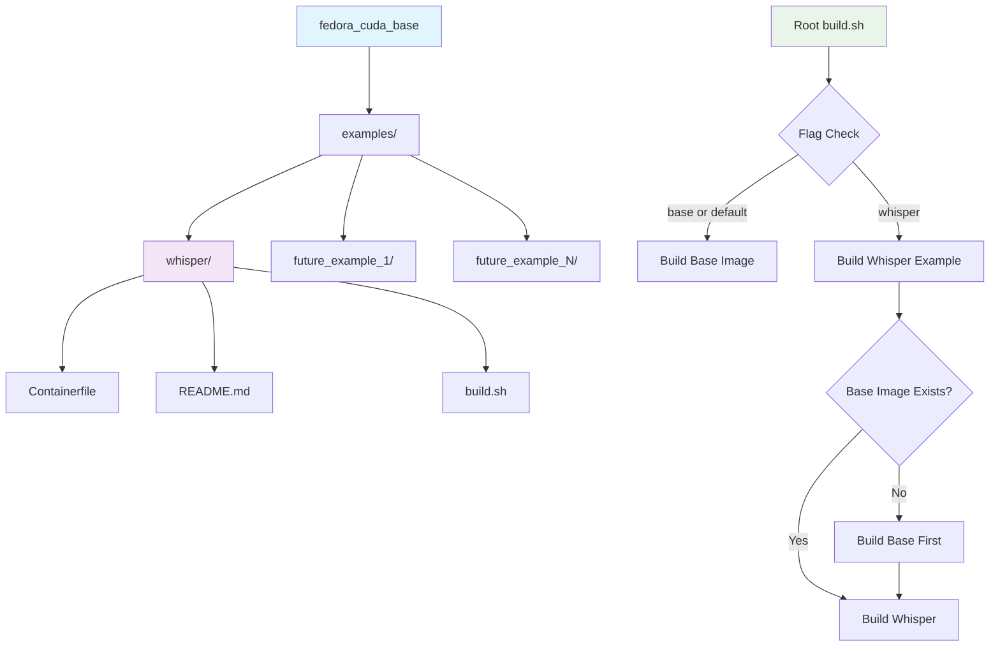

# Product Requirements Document (PRD)
## Modular CUDA Container System with Examples

**Version:** 1.0  
**Date:** June 9, 2025  
**Author:** Architecture Team  
**Status:** Draft  

---

## Executive Summary

This PRD outlines the enhancement of the existing Fedora CUDA Base Container system to support modular examples built on top of the base image. The goal is to create a scalable architecture that allows easy creation and management of specialized GPU-accelerated containers while maintaining the integrity of the base system.

## Problem Statement

The current CUDA base container system provides a solid foundation for GPU-accelerated applications but lacks:
- **Modularity**: No structured way to create specialized containers
- **Examples**: No reference implementations for common use cases
- **Build Management**: Single-purpose build system without target selection
- **Documentation**: Limited guidance for extending the base system

## Goals and Objectives

### Primary Goals
1. **Extend build system** to support multiple container targets
2. **Create modular examples structure** for specialized containers
3. **Implement Whisper example** as the first reference implementation
4. **Maintain backward compatibility** with existing base container functionality
5. **Provide comprehensive documentation** for the new architecture

### Success Metrics
- ✅ Base container functionality remains unchanged
- ✅ New examples can be built independently
- ✅ Build system automatically manages dependencies
- ✅ Clear documentation enables easy extension
- ✅ Whisper example demonstrates GPU acceleration

## Architecture Overview



## Detailed Requirements

### 1. Enhanced Build System

#### 1.1 Build Script Enhancement
- **Current State**: [`build.sh`](build.sh) builds only the base container
- **Required Changes**:
  - Accept command-line arguments for target selection
  - Support `base` (default) and `whisper` targets
  - Implement dependency checking for base image
  - Provide clear error messages and usage instructions

#### 1.2 Build Commands
```bash
./build.sh              # Build base container (default)
./build.sh base          # Build base container (explicit)
./build.sh whisper       # Build whisper example
```

#### 1.3 Dependency Management
- Check if `fedora_cuda_base:latest` exists before building examples
- Auto-prompt to build base image if missing
- Fail gracefully with clear instructions if dependencies are not met

### 2. Examples Structure

#### 2.1 Directory Structure
```
examples/
└── whisper/
    ├── Containerfile      # Whisper container definition
    ├── README.md          # Whisper-specific documentation
    └── build.sh           # Optional local build script
```

#### 2.2 Design Principles
- **Self-contained**: Each example includes all necessary files
- **Consistent**: Follow standardized structure across all examples
- **Documented**: Each example has comprehensive README
- **Extensible**: Easy to add new examples following the pattern

### 3. Whisper Example Implementation

#### 3.1 Container Specifications
- **Base Image**: `FROM fedora_cuda_base:latest`
- **Container Name**: `fedora_cuda_whisper:latest`
- **Primary Software**: OpenAI Whisper with CUDA support
- **Workspace**: Mount `./workspace` for audio file processing

#### 3.2 Functional Requirements
- **Audio Format Support**: `.wav`, `.mp3`, `.m4a`, `.flac`
- **CUDA Acceleration**: GPU-accelerated transcription
- **Output Formats**: Text, SRT, VTT subtitle formats
- **Command Interface**: Direct whisper CLI access from container
- **File Access**: Seamless access to host workspace files

#### 3.3 Usage Examples
```bash
# Build whisper container
./build.sh whisper

# Run whisper on audio file
podman run --device nvidia.com/gpu=all -v ./workspace:/workspace:Z \
  -it --rm fedora_cuda_whisper:latest \
  whisper /workspace/audio.wav --model medium --output_format srt
```

### 4. Documentation Requirements

#### 4.1 Main README Updates
- Add "Examples" section with overview
- Include whisper build and usage instructions
- Maintain existing documentation structure
- Add links to example-specific documentation

#### 4.2 Whisper README
- **Location**: `examples/whisper/README.md`
- **Content Requirements**:
  - Installation and build instructions
  - Usage examples with common whisper commands
  - Supported audio formats and output options
  - Troubleshooting guide
  - Performance optimization tips

### 5. Technical Specifications

#### 5.1 Container Requirements
- **Base Image**: Must use existing `fedora_cuda_base:latest`
- **GPU Access**: Full CUDA and cuDNN support inherited from base
- **Python Environment**: Python 3.12 with pip (from base)
- **Additional Dependencies**: Whisper-specific packages only

#### 5.2 Build Process
1. **Dependency Check**: Verify base image exists
2. **Context Setup**: Use examples/whisper as build context
3. **Image Build**: Build whisper container with proper tagging
4. **Verification**: Basic functionality test after build
5. **Documentation**: Display usage instructions

#### 5.3 Workspace Integration
- **Mount Point**: `/workspace` inside container
- **Host Path**: `./workspace` relative to project root
- **Permissions**: Read/write access with proper SELinux context
- **File Types**: Support for common audio formats

## Implementation Phases

### Phase 1: Build System Enhancement
- **Duration**: 1 development session
- **Deliverables**:
  - Enhanced [`build.sh`](build.sh) with flag support
  - Dependency checking logic
  - Error handling and user guidance

### Phase 2: Examples Structure
- **Duration**: 1 development session
- **Deliverables**:
  - `examples/` directory structure
  - Template structure for future examples
  - Basic whisper container framework

### Phase 3: Whisper Implementation
- **Duration**: 1-2 development sessions
- **Deliverables**:
  - Complete whisper Containerfile
  - Whisper-specific build logic
  - Basic functionality testing

### Phase 4: Documentation
- **Duration**: 1 development session
- **Deliverables**:
  - Updated main README.md
  - Complete whisper README.md
  - Usage examples and troubleshooting guides

### Phase 5: Testing and Validation
- **Duration**: 1 development session
- **Deliverables**:
  - End-to-end testing of build process
  - Whisper functionality validation
  - Documentation accuracy verification

## Risk Assessment

### Technical Risks
- **Base Image Compatibility**: Changes to base image could break examples
  - *Mitigation*: Use specific base image tags, maintain compatibility matrix
- **GPU Access Issues**: Container GPU passthrough complexity
  - *Mitigation*: Inherit proven GPU configuration from base container
- **Build Dependencies**: Complex dependency management
  - *Mitigation*: Clear error messages and automated dependency resolution

### User Experience Risks
- **Complexity**: New build system might confuse existing users
  - *Mitigation*: Maintain backward compatibility, clear documentation
- **Documentation Drift**: Examples documentation becoming outdated
  - *Mitigation*: Include documentation updates in development process

## Success Criteria

### Functional Requirements
- [ ] Base container builds and functions identically to current version
- [ ] `./build.sh whisper` successfully builds whisper container
- [ ] Whisper container can process audio files with GPU acceleration
- [ ] All existing functionality remains intact
- [ ] Documentation is complete and accurate

### Non-Functional Requirements
- [ ] Build time for examples is reasonable (< 10 minutes)
- [ ] Clear error messages for all failure scenarios
- [ ] Examples follow consistent structure and naming
- [ ] Documentation is comprehensive and easy to follow

## Future Considerations

### Extensibility
- **Additional Examples**: Framework supports easy addition of new examples
- **Build Targets**: System can be extended to support more complex build scenarios
- **CI/CD Integration**: Architecture supports automated testing and deployment

### Potential Examples
- **Stable Diffusion**: Image generation with CUDA acceleration
- **LLaMA/Ollama**: Large language model inference
- **Computer Vision**: OpenCV with CUDA support
- **Scientific Computing**: NumPy/SciPy with GPU acceleration

## Appendix

### Current File Structure
```
fedora_cuda_base/
├── build.sh                    # Current build script
├── Containerfile              # Base container definition
├── README.md                  # Current documentation
├── debug-cudnn.sh             # Debugging utilities
├── test-cuda-installation.py  # CUDA validation
├── test-gpu.sh                # GPU testing
├── podman-compose.yml         # Container orchestration
└── workspace/                 # Shared workspace
```

### Proposed File Structure
```
fedora_cuda_base/
├── build.sh                    # Enhanced build script
├── Containerfile              # Base container (unchanged)
├── README.md                  # Updated with examples section
├── examples/
│   └── whisper/
│       ├── Containerfile      # Whisper container
│       ├── README.md          # Whisper documentation
│       └── build.sh           # Optional local build
├── plan/
│   └── PRD-Modular-CUDA-Container-System.md
├── workspace/                 # Shared workspace
└── [existing files...]        # All current files preserved
```

---

**Document Status**: Ready for Implementation  
**Next Steps**: Begin Phase 1 implementation with enhanced build system